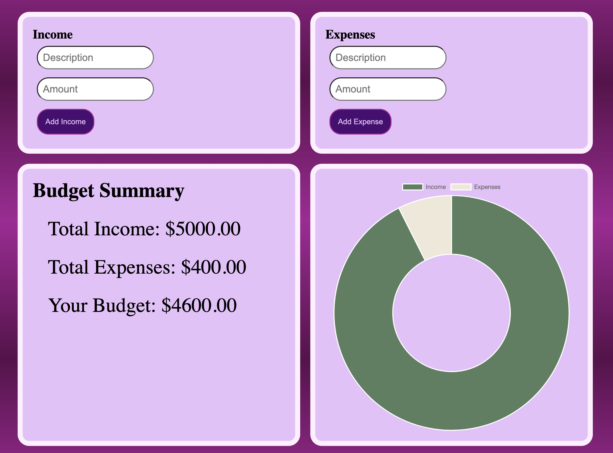

# **Budget Tracker**

This budget tracker makes managing your finances simple and fun! Just enter a description and amount for your income, then do the same for your expenses. Once you submit your entries, the summary instantly updates to show your current budget. Styled in soft purples and eye-catching gradients, this tool is designed to be both useful and easy on the eyes. 

Below you will see requirements I met for this Project as well as DOCUMENTATION and brief explanation of my code.

---
## **Table of Contents** 
**Requirements**
- [UserInterface](#UserInterface)
- [Budget Calculation](#BudgetCalculation)
- [Functionality](#Functionality)
- [Display Summary](#DisplaySummary)
- [Object-Oreintation Programming](#Object-OreintationProgramming)
- [Styling](#Styling)
- [Hosted site link](#hostedsitelink)
---
## **UserInterface**
When the user accesses the Budget Tracker, they see two input fields along with a submit section. The submit button is a deep purple, and when the user hovers over it, its color changes.
- contains in HTML "Income section", "Expense section", "Budget Summary Section"
- within those section it contains a "Description"(text) and "Amount"(number) where the user types their inputs.

---
## **Budget Calculation**
The calculation takes place once it takes the user's input of Income and Expenses.
- Contains a class of "totalBudget" 
and takes in two seperate arrays for the Income "incomeX", and expenses "expenseY".

- Within this, the budget is calculated using my getTotalBudget function, which first sums the income and expenses separately, and then subtracts the total expenses from the total income to produce the updated budget.

- This handles inputs whether negative or postive because it only allows inputs greater than 0.

---
## **Functionality**
- The user must enter a description of their choice (without numbers) and provide an amount before submitting. If the user attempts to submit without completing one or both fields, a validation alert will appear.

    - the function "isValidUserInput" catches any errors the users will type.

    - "(/\d/.test(description))" checks for digits and the ".test" is a boolean and set it equal to false, and will return an alert if it matches.  

    - "(isNaN)" and "< = 0" catches either if the amount is not a number or catches a value less than zero.

- the "income.XForm.addeventListner" is tied to a "preventDefault" which prevents the submison unless all the form meets the validation checks.
---
## **Display Summary**
- "reloadUI" is build to display in the html provided by the updated inputs from the user.
    -"toFixed(2) - allows only two decimals.
- "UpdateChart" is a function that recieves the data from users input of Income and expenses. 

---
## **Object-Orientation Programming**
- Object Orientation was utilized when creating "class totalBudget" 
    - The "totalBudget" encapsulates the data from the income and expenses. 

    - The methods used "UserIncome()", " UserExpense()", "getTotalIncomeX()", "getTotalExpenseY() ", "getTotalBudget()".
---
## **Styling**
Implemented SASS 
- created "$primary-color:#FFE5FB"

- set the "$primary-color" to ".main_title" a heading element.

- set background color to the Gradient mixin "@mixin unique-gradient($color3, $color5, $direction: 360deg)"

- incorporated hover animation to make the application appealing.

---
## **Hosted site link**
Test it out Here!

---